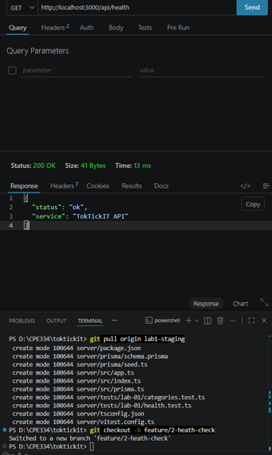

# Lab 1 — Test Plan and Evidence

All test files live under server/tests/lab-01/ and client/tests/lab-01/.

| # | Tool | Test | Result |
|---|------|------|--------|
| 1 | Supertest | GET /api/health returns 200, status=ok | Passed |
| 2 | Supertest | GET /api/categories returns 4 seeded categories in id order | Passed |
| 3 | Vitest | Heading renders | Passed |
| 4 | Vitest | Success state shows Online + category list | Passed |
| 5 | Vitest | Error state shows Offline + message | Passed |

Paste your passing terminal output / screenshot below.


.png>)
.png>)
.png>)
.png>)

```text
RUN  v2.1.9 D:/CPE334/toktickit/server

> toktickit-server@1.0.0 test
> vitest run

 ✓ tests/lab-01/categories.test.ts (1)
 ✓ tests/lab-01/health.test.ts (1)

 Test Files  2 passed (2)
      Tests  2 passed (2)
   Start at  14:38:51
   Duration  2.76s (transform 102ms, setup 0ms, collect 3.07s, tests 106ms, environment 1ms, prepare 1.37s)

RUN  v2.1.9 D:/CPE334/toktickit/client

 ✓ tests/lab-01/App.test.tsx (3)
   ✓ App (3)
     ✓ renders the TokTickIT heading
     ✓ shows Online and the seeded categories on success
     ✓ shows an Offline error message when the API is unavailable

 Test Files  1 passed (1)
      Tests  3 passed (3)
   Start at  00:43:39
   Duration  1.94s (transform 67ms, setup 164ms, collect 287ms, tests 204ms, environment 822ms, prepare 145ms)